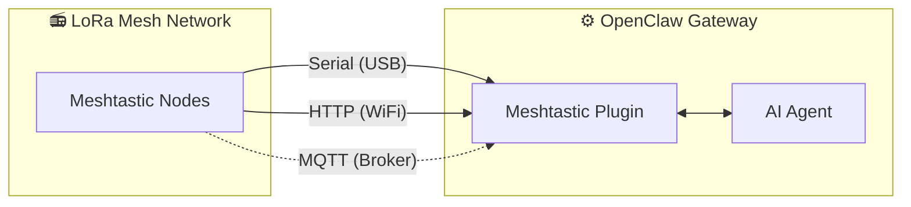

# MeshClaw: Plugin de canal Meshtastic para OpenClaw

<p align="center">
  <a href="https://www.npmjs.com/package/@seeed-studio/meshtastic">
    
  </a>
  <a href="https://www.npmjs.com/package/@seeed-studio/meshtastic">
    
  </a>
</p>

<!-- LANG_SWITCHER_START -->
<p align="center">
  <a href="README.md">English</a> | <a href="README.zh-CN.md">中文</a> | <a href="README.ja.md">日本語</a> | <a href="README.fr.md">Français</a> | <a href="README.pt.md">Português</a> | <b>Español</b>
</p>
<!-- LANG_SWITCHER_END -->

MeshClaw es un plugin de canal para OpenClaw que permite a tu gateway de IA enviar y recibir mensajes a través de Meshtastic, sin internet ni torres celulares: solo ondas de radio. Habla con tu asistente de IA desde la montaña, el océano o cualquier lugar fuera de la red.

⭐ Danos una estrella en GitHub: ¡nos motiva muchísimo!

> [!IMPORTANT]
> Este es un plugin de canal para el gateway de IA [OpenClaw](https://github.com/openclaw/openclaw), no una aplicación independiente. Necesitas una instancia de OpenClaw en ejecución (Node.js 22+) para usarlo.

[Documentación][docs] · [Guía de hardware](#hardware-recomendado) · [Reportar error][issues] · [Solicitar función][issues]

## Tabla de contenidos

- [Cómo funciona](#cómo-funciona)
- [Hardware recomendado](#hardware-recomendado)
- [Características](#características)
- [Capacidades y hoja de ruta](#capacidades-y-hoja-de-ruta)
- [Demostración](#demostración)
- [Inicio rápido](#inicio-rápido)
- [Asistente de configuración](#asistente-de-configuración)
- [Configuración](#1-transporte)
- [Solución de problemas](#2-región-lora)
- [Desarrollo](#3-nombre-del-nodo)
- [Contribuir](#4-acceso-a-canales-grouppolicy)

## Cómo funciona



El plugin actúa como puente entre dispositivos LoRa Meshtastic y el agente de IA de OpenClaw. Soporta tres modos de transporte:

- Serial: conexión USB directa a un dispositivo Meshtastic local
- HTTP: conexión a un dispositivo por WiFi / red local
- MQTT: suscripción a un broker MQTT de Meshtastic, sin hardware local

Los mensajes entrantes pasan por control de acceso (política de DM, política de grupo, requisito de mención) antes de llegar a la IA. Las respuestas salientes se despojan del formato Markdown (los dispositivos LoRa no pueden renderizarlo) y se fragmentan para ajustarse a los límites de tamaño de los paquetes de radio.

## Hardware recomendado

<p align="center">
  
</p>

| Dispositivo                    | Ideal para               | Enlace            |
| ----------------------------- | ------------------------ | ----------------- |
| XIAO ESP32S3 + Wio-SX1262 kit | Desarrollo inicial       | [Comprar][hw-xiao] |
| Wio Tracker L1 Pro            | Gateway de campo portátil| [Comprar][hw-wio]  |
| SenseCAP Card Tracker T1000-E | Rastreador compacto      | [Comprar][hw-sensecap] |

¿Sin hardware? El transporte por MQTT se conecta vía broker: no se requiere dispositivo local.

Cualquier dispositivo compatible con Meshtastic funciona.

## Características

- Integración con agente de IA: conecta los agentes de IA de OpenClaw con redes de malla LoRa Meshtastic. Habilita comunicación inteligente sin depender de la nube.

- Tres modos de transporte: Serial (USB), HTTP (WiFi) y MQTT

- Canales de DM y de grupo con control de acceso: soporta ambos modos de conversación con listas de permitidos de DM, reglas de respuesta por canal y requisito de mención

- Soporte para múltiples cuentas: ejecuta varias conexiones independientes simultáneamente

- Comunicación de malla resiliente: reconexión automática con reintentos configurables. Maneja caídas de conexión de forma robusta.

## Capacidades y hoja de ruta

El plugin trata Meshtastic como un canal de primera clase —al igual que Telegram o Discord— permitiendo conversaciones con IA e invocación de herramientas completamente por radio LoRa, sin dependencia de internet.

| Consultar información sin conexión                        | Puente entre canales: envía fuera de la red, recibe en cualquier lugar | 🔜 Qué sigue: |
| --------------------------------------------------------- | ---------------------------------------------------------------------- | ------------- |
|  |  | Planeamos incorporar datos en tiempo real de los nodos (ubicación GPS, sensores ambientales, estado del dispositivo) en el contexto de OpenClaw, permitiendo que la IA supervise la salud de la red de malla y emita alertas proactivas sin esperar consultas de usuarios. |

## Demostración

<div align="center">

https://github.com/user-attachments/assets/837062d9-a5bb-4e0a-b7cf-298e4bdf2f7c

</div>

Alternativa: [media/demo.mp4](media/demo.mp4)

## Inicio rápido

```bash
# 1. Install plugin
openclaw plugins install @seeed-studio/meshtastic

# 2. Guided setup — walks you through transport, region, and access policy
openclaw onboard

# 3. Verify
openclaw channels status --probe
```

<p align="center">
  
</p>

## Asistente de configuración

Ejecutar `openclaw onboard` inicia un asistente interactivo que te guía por cada paso de configuración. Abajo explicamos qué significa cada paso y cómo elegir.

### 1. Transporte

Cómo se conecta el gateway a la malla Meshtastic:

| Opción             | Descripción                                                    | Requiere                                        |
| ------------------ | -------------------------------------------------------------- | ----------------------------------------------- |
| Serial (USB)       | Conexión USB directa a un dispositivo local. Autodetecta puertos disponibles. | Dispositivo Meshtastic conectado por USB        |
| HTTP (WiFi)        | Conexión a un dispositivo en la red local.                     | IP o hostname del dispositivo (p. ej. `meshtastic.local`) |
| MQTT (broker)      | Conexión a la malla vía un broker MQTT — no requiere hardware local. | Dirección del broker, credenciales y tema de suscripción |

### 2. Región LoRa

> Solo Serial y HTTP. MQTT deriva la región del tema de suscripción.

Configura la región de frecuencia de radio en el dispositivo. Debe coincidir con tus normativas locales y con otros nodos de la malla. Opciones comunes:

| Región   | Frecuencia        |
| -------- | ----------------- |
| US       | 902–928 MHz       |
| EU_868   | 869 MHz           |
| CN       | 470–510 MHz       |
| JP       | 920 MHz           |
| UNSET    | Mantener la predeterminada del dispositivo |

Consulta la documentación de regiones de Meshtastic: https://meshtastic.org/docs/getting-started/initial-config/#lora

### 3. Nombre del nodo

El nombre visible del dispositivo en la malla. También se usa como el disparador de @mención en canales de grupo: otros usuarios envían `@OpenClaw` para hablar con tu bot.

- Serial / HTTP: opcional — se detecta automáticamente del dispositivo conectado si se deja en blanco.
- MQTT: obligatorio — no hay un dispositivo físico del cual leer el nombre.

### 4. Acceso a canales (`groupPolicy`)

Controla si y cómo el bot responde en canales de grupo de la malla (p. ej., LongFast, Emergency):

| Política             | Comportamiento                                               |
| -------------------- | ------------------------------------------------------------ |
| `disabled` (pred.)   | Ignora todos los mensajes en canales de grupo. Solo se procesan DMs. |
| `open`               | Responde en todos los canales de la malla.                  |
| `allowlist`          | Responde solo en los canales listados. Se te pedirá ingresar nombres de canal (separados por comas, p. ej. `LongFast, Emergency`). Usa `*` como comodín para coincidir con todos. |

### 5. Requerir mención

> Solo aparece cuando el acceso a canales está habilitado (no `disabled`).

Cuando está activado (predeterminado: sí), el bot solo responde en canales de grupo cuando alguien menciona su nombre de nodo (p. ej., `@OpenClaw ¿cómo está el clima?`). Esto evita que el bot responda a cada mensaje del canal.

Si está desactivado, el bot responde a todos los mensajes en los canales permitidos.

### 6. Política de acceso por DM (`dmPolicy`)

Controla quién puede enviar mensajes directos (DM) al bot:

| Política            | Comportamiento                                               |
| ------------------- | ------------------------------------------------------------ |
| `pairing` (pred.)   | Nuevos remitentes activan una solicitud de emparejamiento que debe aprobarse antes de poder chatear. |
| `open`              | Cualquiera en la malla puede enviar DMs al bot libremente.   |
| `allowlist`         | Solo los nodos listados en `allowFrom` pueden enviar DM. Los demás se ignoran. |

### 7. Lista de permitidos para DM (`allowFrom`)

> Solo aparece cuando `dmPolicy` es `allowlist`, o cuando el asistente determina que se necesita.

Una lista de IDs de usuario Meshtastic autorizados a enviar mensajes directos. Formato: `!aabbccdd` (ID de usuario en hex). Varias entradas se separan por comas.

<p align="center">
  
</p>

### 8. Nombres visibles de cuentas

> Solo aparece para configuraciones de múltiples cuentas. Opcional.

Asigna nombres legibles a tus cuentas. Por ejemplo, una cuenta con ID `home` podría mostrarse como "Estación Hogar". Si se omite, se usa el ID de cuenta tal cual. Es puramente cosmético y no afecta la funcionalidad.

## Configuración

La configuración guiada (`openclaw onboard`) cubre todo lo siguiente. Consulta el Asistente de configuración para un recorrido paso a paso. Para configurar manualmente, edita con `openclaw config edit`.

### Serial (USB)

```yaml
channels:
  meshtastic:
    transport: serial
    serialPort: /dev/ttyUSB0
    nodeName: OpenClaw
```

### HTTP (WiFi)

```yaml
channels:
  meshtastic:
    transport: http
    httpAddress: meshtastic.local
    nodeName: OpenClaw
```

### MQTT (broker)

```yaml
channels:
  meshtastic:
    transport: mqtt
    nodeName: OpenClaw
    mqtt:
      broker: mqtt.meshtastic.org
      username: meshdev
      password: large4cats
      topic: "msh/US/2/json/#"
```

### Múltiples cuentas

```yaml
channels:
  meshtastic:
    accounts:
      home:
        transport: serial
        serialPort: /dev/ttyUSB0
      remote:
        transport: mqtt
        mqtt:
          broker: mqtt.meshtastic.org
          topic: "msh/US/2/json/#"
```

<details>
<summary><b>Referencia de todas las opciones</b></summary>

| Clave               | Tipo                            | Predeterminado        | Notas                                                        |
| ------------------- | ------------------------------- | --------------------- | ------------------------------------------------------------ |
| `transport`         | `serial \| http \| mqtt`        | `serial`              |                                                              |
| `serialPort`        | `string`                        | —                     | Requerido para serial                                        |
| `httpAddress`       | `string`                        | `meshtastic.local`    | Requerido para HTTP                                          |
| `httpTls`           | `boolean`                       | `false`               |                                                              |
| `mqtt.broker`       | `string`                        | `mqtt.meshtastic.org` |                                                              |
| `mqtt.port`         | `number`                        | `1883`                |                                                              |
| `mqtt.username`     | `string`                        | `meshdev`             |                                                              |
| `mqtt.password`     | `string`                        | `large4cats`          |                                                              |
| `mqtt.topic`        | `string`                        | `msh/US/2/json/#`     | Tema de suscripción                                          |
| `mqtt.publishTopic` | `string`                        | derivado              |                                                              |
| `mqtt.tls`          | `boolean`                       | `false`               |                                                              |
| `region`            | enum                            | `UNSET`               | `US`, `EU_868`, `CN`, `JP`, `ANZ`, `KR`, `TW`, `RU`, `IN`, `NZ_865`, `TH`, `EU_433`, `UA_433`, `UA_868`, `MY_433`, `MY_919`, `SG_923`, `LORA_24`. Solo Serial/HTTP. |
| `nodeName`          | `string`                        | auto-detect           | Nombre visible y disparador de @mención. Requerido para MQTT. |
| `dmPolicy`          | `open \| pairing \| allowlist`  | `pairing`             | Quién puede enviar mensajes directos. Ver [Política de acceso por DM](#6-politica-de-acceso-por-dm-dmpolicy). |
| `allowFrom`         | `string[]`                      | —                     | IDs de nodo para la lista de permitidos de DM, p. ej. `["!aabbccdd"]` |
| `groupPolicy`       | `open \| allowlist \| disabled` | `disabled`            | Política de respuesta en canales de grupo. Ver [Acceso a canales](#4-acceso-a-canales-grouppolicy). |
| `channels`          | `Record<string, object>`        | —                     | Anulaciones por canal: `requireMention`, `allowFrom`, `tools` |

</details>

<details>
<summary><b>Sobrescritura por variables de entorno</b></summary>

Estas variables sobrescriben la configuración de la cuenta predeterminada (YAML tiene prioridad para cuentas con nombre):

| Variable                   | Clave de config equivalente |
| -------------------------- | --------------------------- |
| `MESHTASTIC_TRANSPORT`     | `transport`                 |
| `MESHTASTIC_SERIAL_PORT`   | `serialPort`                |
| `MESHTASTIC_HTTP_ADDRESS`  | `httpAddress`               |
| `MESHTASTIC_MQTT_BROKER`   | `mqtt.broker`               |
| `MESHTASTIC_MQTT_TOPIC`    | `mqtt.topic`                |

</details>

## Solución de problemas

| Síntoma              | Verificar                                                    |
| -------------------- | ------------------------------------------------------------ |
| No conecta por Serial | ¿Ruta del dispositivo correcta? ¿El host tiene permisos?    |
| No conecta por HTTP  | ¿`httpAddress` es alcanzable? ¿`httpTls` coincide con el dispositivo? |
| MQTT no recibe nada  | ¿La región en `mqtt.topic` es correcta? ¿Credenciales del broker válidas? |
| Sin respuestas por DM | ¿`dmPolicy` y `allowFrom` configurados? Ver [Política de acceso por DM](#6-politica-de-acceso-por-dm-dmpolicy). |
| Sin respuestas en grupo | ¿`groupPolicy` habilitada? ¿El canal está en la lista permitida? ¿Se requiere mención? Ver [Acceso a canales](#4-acceso-a-canales-grouppolicy). |

¿Encontraste un bug? [Abre un issue][issues] con el tipo de transporte, configuración (oculta secretos) y la salida de `openclaw channels status --probe`.

## Desarrollo

```bash
git clone https://github.com/Seeed-Solution/MeshClaw.git
cd MeshClaw
npm install
openclaw plugins install -l ./MeshClaw
```

Sin paso de build: OpenClaw carga directamente el código fuente TypeScript. Usa `openclaw channels status --probe` para verificar.

## Contribuir

- [Abre un issue][issues] para bugs o solicitudes de funciones
- Pull requests bienvenidos — mantén el código alineado con las convenciones existentes de TypeScript

<!-- Enlaces de referencia -->
[docs]: https://meshtastic.org/docs/
[issues]: https://github.com/Seeed-Solution/MeshClaw/issues
[hw-xiao]: https://www.seeedstudio.com/Wio-SX1262-with-XIAO-ESP32S3-p-5982.html
[hw-wio]: https://www.seeedstudio.com/Wio-Tracker-L1-Pro-p-6454.html
[hw-sensecap]: https://www.seeedstudio.com/SenseCAP-Card-Tracker-T1000-E-for-Meshtastic-p-5913.html