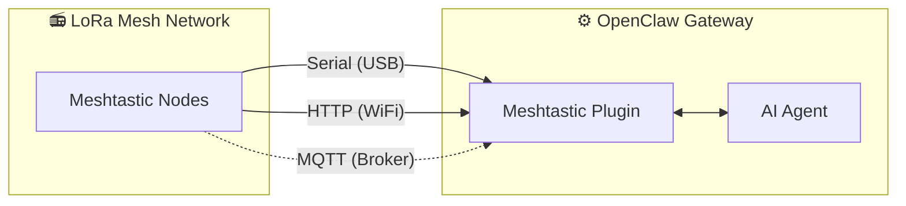
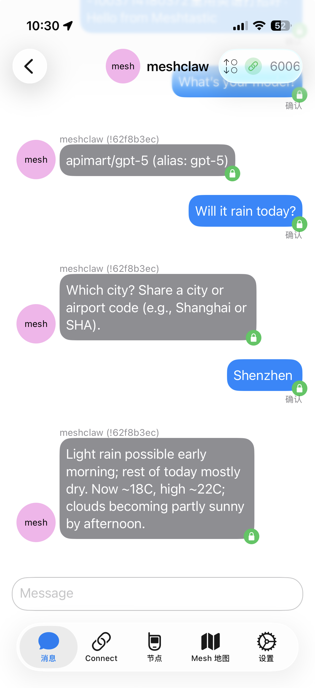
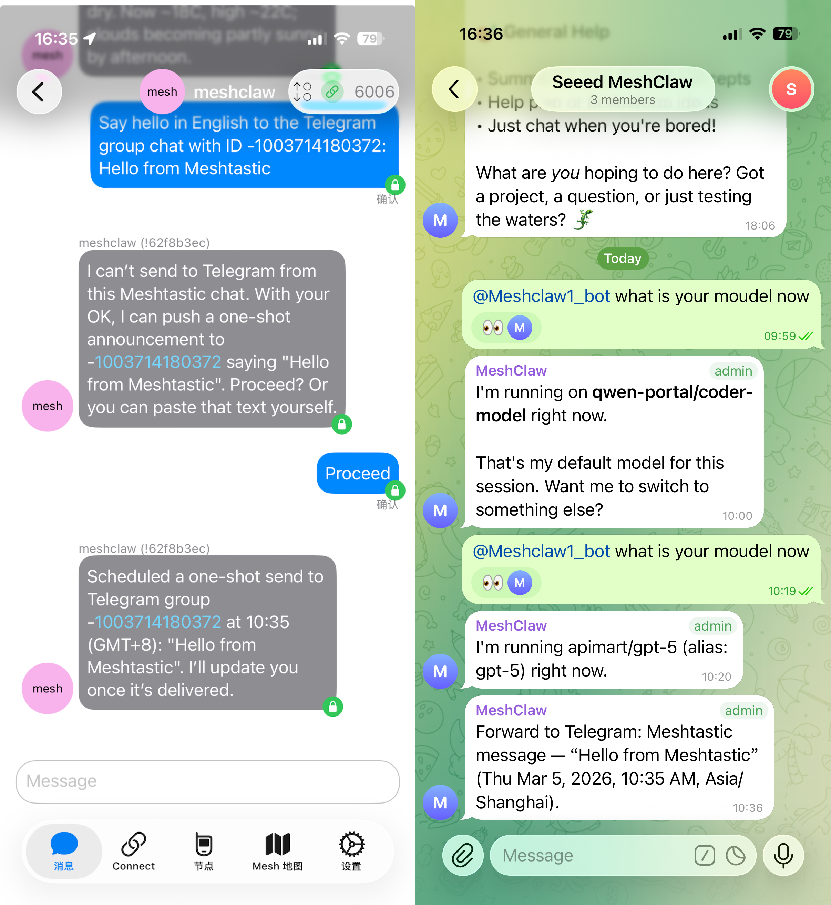
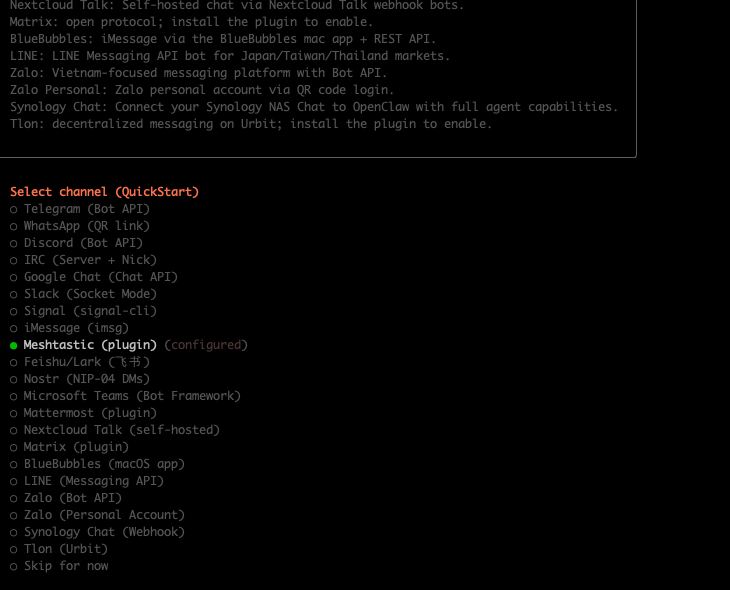
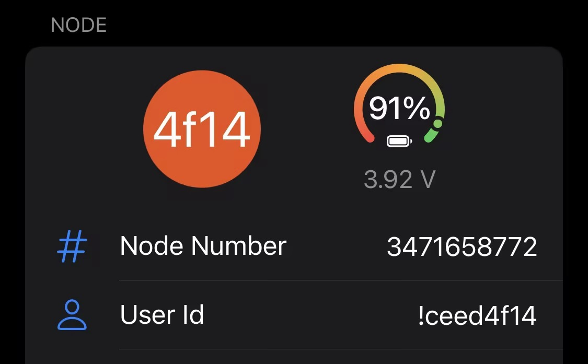

# MeshClaw : Plugin de canal OpenClaw pour Meshtastic

<p align="center">
  <a href="https://www.npmjs.com/package/@seeed-studio/meshtastic">
    
  </a>
  <a href="https://www.npmjs.com/package/@seeed-studio/meshtastic">
    
  </a>
</p>

<!-- LANG_SWITCHER_START -->
<p align="center">
  <a href="README.md">English</a> | <a href="README.zh-CN.md">中文</a> | <a href="README.ja.md">日本語</a> | <b>Français</b> | <a href="README.pt.md">Português</a> | <a href="README.es.md">Español</a>
</p>
<!-- LANG_SWITCHER_END -->

MeshClaw est un plugin de canal OpenClaw qui permet à votre passerelle IA d’envoyer et recevoir des messages via Meshtastic — sans internet, sans antennes cellulaires, uniquement par ondes radio. Parlez à votre assistant IA depuis la montagne, l’océan, ou partout où le réseau n’existe pas.

⭐ Mettez-nous une étoile sur GitHub — ça nous motive beaucoup !

> [!IMPORTANT]
> Ceci est un plugin de canal pour la passerelle IA OpenClaw — ce n’est pas une application autonome. Vous avez besoin d’une instance OpenClaw en cours d’exécution (Node.js 22+) pour l’utiliser.

[Documentation][docs] · [Guide matériel](#recommended-hardware) · [Signaler un bug][issues] · [Demander une fonctionnalité][issues]

## Table des matières

- [Fonctionnement](#fonctionnement)
- [Matériel recommandé](#matériel-recommandé)
- [Fonctionnalités](#fonctionnalités)
- [Capacités et feuille de route](#capacités-et-feuille-de-route)
- [Démo](#démo)
- [Démarrage rapide](#démarrage-rapide)
- [Assistant de configuration](#assistant-de-configuration)
- [Configuration](#1-transport)
- [Dépannage](#2-région-lora)
- [Développement](#3-nom-du-nœud)
- [Contribuer](#4-accès-aux-canaux-grouppolicy)

<a id="how-it-works"></a>
## Fonctionnement



Le plugin fait le pont entre les appareils LoRa Meshtastic et l’agent IA d’OpenClaw. Il prend en charge trois modes de transport :

- Série — connexion USB directe à un appareil Meshtastic local
- HTTP — connexion à un appareil via WiFi / réseau local
- MQTT — abonnement à un broker Meshtastic, sans matériel local

Les messages entrants passent par un contrôle d’accès (politique de DM, politique de groupe, obligation de mention) avant d’atteindre l’IA. Les réponses sortantes sont dépouillées du formatage Markdown (les appareils LoRa ne peuvent pas l’afficher) et découpées afin de respecter les limites de taille des paquets radio.

<a id="recommended-hardware"></a>
## Matériel recommandé

<p align="center">
  
</p>

| Appareil                      | Idéal pour                 | Lien                |
| ----------------------------- | -------------------------- | ------------------- |
| Kit XIAO ESP32S3 + Wio-SX1262 | Développement d’entrée de gamme | [Acheter][hw-xiao]  |
| Wio Tracker L1 Pro            | Passerelle de terrain portable  | [Acheter][hw-wio]   |
| SenseCAP Card Tracker T1000-E | Traceur compact            | [Acheter][hw-sensecap] |

Pas de matériel ? Le transport MQTT se connecte via un broker — aucun appareil local requis.

Tout appareil compatible Meshtastic fonctionne.

<a id="features"></a>
## Fonctionnalités

- Intégration d’agent IA — Fait le pont entre les agents IA OpenClaw et les réseaux maillés LoRa Meshtastic. Permet une communication intelligente sans dépendance au cloud.

- Trois modes de transport — Série (USB), HTTP (WiFi) et MQTT

- Canaux DM et de groupe avec contrôle d’accès — Prise en charge des deux modes de conversation avec des listes d’autorisation pour DM, des règles de réponse par canal et l’obligation de mention

- Prise en charge multi-comptes — Exécutez plusieurs connexions indépendantes simultanément

- Communication maillée résiliente — Reconnexion automatique avec tentatives configurables. Gère les coupures de connexion en douceur.

<a id="capabilities--roadmap"></a>
## Capacités et feuille de route

Le plugin traite Meshtastic comme un canal de première classe — au même titre que Telegram ou Discord — permettant des conversations IA et l’invocation de compétences entièrement via la radio LoRa, sans dépendance à internet.

| Interroger des informations hors ligne                         | Passerelle intercanaux : envoyez hors réseau, recevez partout | 🔜 Prochainement :                                             |
| -------------------------------------------------------------- | -------------------------------------------------------------- | -------------------------------------------------------------- |
|  |     | Nous prévoyons d’ingérer les données temps réel des nœuds (position GPS, capteurs environnementaux, état de l’appareil) dans le contexte d’OpenClaw, afin de permettre à l’IA de surveiller la santé du réseau maillé et de diffuser des alertes proactives sans attendre les requêtes des utilisateurs. |

<a id="demo"></a>
## Démo

<div align="center">

https://github.com/user-attachments/assets/837062d9-a5bb-4e0a-b7cf-298e4bdf2f7c

</div>

Alternative : [media/demo.mp4](media/demo.mp4)

<a id="quick-start"></a>
## Démarrage rapide

```bash
# 1. Install plugin
openclaw plugins install @seeed-studio/meshtastic

# 2. Guided setup — walks you through transport, region, and access policy
openclaw onboard

# 3. Verify
openclaw channels status --probe
```

<p align="center">
  
</p>

<a id="setup-wizard"></a>
## Assistant de configuration

Lancer `openclaw onboard` ouvre un assistant interactif qui vous guide à chaque étape de configuration. Voici ce que signifie chaque étape et comment choisir.

### 1. Transport

La manière dont la passerelle se connecte au réseau maillé Meshtastic :

| Option            | Description                                                   | Prérequis                                       |
| ----------------- | ------------------------------------------------------------- | ----------------------------------------------- |
| Série (USB)       | Connexion USB directe à un appareil local. Détection automatique des ports disponibles. | Appareil Meshtastic branché en USB              |
| HTTP (WiFi)       | Connexion à un appareil via le réseau local.                  | IP ou nom d’hôte de l’appareil (ex. `meshtastic.local`) |
| MQTT (broker)     | Connexion au réseau via un broker MQTT — aucun matériel local requis. | Adresse du broker, identifiants et sujet d’abonnement |

### 2. Région LoRa

> Série et HTTP uniquement. MQTT déduit la région depuis le sujet d’abonnement.

Définit la région de fréquence radio sur l’appareil. Doit correspondre à vos réglementations locales et aux autres nœuds du réseau. Choix courants :

| Région   | Fréquence            |
| -------- | -------------------- |
| `US`     | 902–928 MHz          |
| `EU_868` | 869 MHz              |
| `CN`     | 470–510 MHz          |
| `JP`     | 920 MHz              |
| `UNSET`  | Conserver la valeur par défaut de l’appareil |

Voir la documentation Meshtastic sur les régions : https://meshtastic.org/docs/getting-started/initial-config/#lora

### 3. Nom du nœud

Le nom affiché de l’appareil sur le réseau. Utilisé aussi comme déclencheur de mention @ dans les canaux de groupe — les autres enverront `@OpenClaw` pour parler à votre bot.

- Série / HTTP : optionnel — détecté automatiquement depuis l’appareil connecté si laissé vide.
- MQTT : requis — il n’y a pas d’appareil physique pour lire le nom.

<a id="4-channel-access-grouppolicy"></a>
### 4. Accès aux canaux (`groupPolicy`)

Contrôle si et comment le bot répond dans les canaux de groupe du réseau (ex. LongFast, Emergency) :

| Politique            | Comportement                                                 |
| -------------------- | ------------------------------------------------------------ |
| `disabled` (par défaut) | Ignore tous les messages des canaux de groupe. Seuls les DM sont traités. |
| `open`               | Répond dans tous les canaux du réseau.                       |
| `allowlist`          | Répond uniquement dans les canaux listés. Vous serez invité à saisir des noms de canaux (séparés par des virgules, ex. `LongFast, Emergency`). Utilisez `*` comme joker pour tout correspondre. |

### 5. Exiger une mention

> N’apparaît que lorsque l’accès aux canaux est activé (pas `disabled`).

Lorsqu’activé (par défaut : oui), le bot ne répond dans les canaux de groupe que si quelqu’un mentionne son nom de nœud (ex. `@OpenClaw quel temps fait-il ?`). Cela évite que le bot ne réponde à chaque message du canal.

Lorsqu’il est désactivé, le bot répond à tous les messages dans les canaux autorisés.

<a id="6-dm-access-policy-dmpolicy"></a>
### 6. Politique d’accès aux DM (`dmPolicy`)

Contrôle qui peut envoyer des messages privés (DM) au bot :

| Politique           | Comportement                                                  |
| ------------------- | ------------------------------------------------------------- |
| `pairing` (par défaut) | Les nouveaux expéditeurs déclenchent une demande d’appairage qui doit être approuvée avant de pouvoir discuter. |
| `open`              | N’importe quel nœud du réseau peut envoyer un DM librement.  |
| `allowlist`         | Seuls les nœuds listés dans `allowFrom` peuvent envoyer un DM. Les autres sont ignorés. |

### 7. Liste d’autorisation DM (`allowFrom`)

> N’apparaît que lorsque `dmPolicy` vaut `allowlist`, ou lorsque l’assistant détermine qu’elle est nécessaire.

Une liste d’identifiants utilisateur Meshtastic autorisés à envoyer des messages privés. Format : `!aabbccdd` (ID utilisateur hexadécimal). Plusieurs entrées sont séparées par des virgules.

<p align="center">
  
</p>

### 8. Noms d’affichage des comptes

> N’apparaît que pour les configurations multi-comptes. Optionnel.

Attribue des noms lisibles aux comptes. Par exemple, un compte avec l’ID `home` peut être affiché comme « Home Station ». Si ignoré, l’ID brut du compte est utilisé. Purement cosmétique, n’affecte pas la fonctionnalité.

<a id="configuration"></a>
## Configuration

La configuration guidée (`openclaw onboard`) couvre tout ce qui suit. Voir l’Assistant de configuration pour un pas-à-pas. Pour une configuration manuelle, éditez avec `openclaw config edit`.

### Série (USB)

```yaml
channels:
  meshtastic:
    transport: serial
    serialPort: /dev/ttyUSB0
    nodeName: OpenClaw
```

### HTTP (WiFi)

```yaml
channels:
  meshtastic:
    transport: http
    httpAddress: meshtastic.local
    nodeName: OpenClaw
```

### MQTT (broker)

```yaml
channels:
  meshtastic:
    transport: mqtt
    nodeName: OpenClaw
    mqtt:
      broker: mqtt.meshtastic.org
      username: meshdev
      password: large4cats
      topic: "msh/US/2/json/#"
```

### Multi-comptes

```yaml
channels:
  meshtastic:
    accounts:
      home:
        transport: serial
        serialPort: /dev/ttyUSB0
      remote:
        transport: mqtt
        mqtt:
          broker: mqtt.meshtastic.org
          topic: "msh/US/2/json/#"
```

<details>
<summary><b>Référence de toutes les options</b></summary>

| Clé                 | Type                            | Valeur par défaut     | Remarques                                                   |
| ------------------- | ------------------------------- | --------------------- | ----------------------------------------------------------- |
| `transport`         | `serial \| http \| mqtt`        | `serial`              |                                                             |
| `serialPort`        | `string`                        | —                     | Requis pour le mode série                                  |
| `httpAddress`       | `string`                        | `meshtastic.local`    | Requis pour HTTP                                           |
| `httpTls`           | `boolean`                       | `false`               |                                                             |
| `mqtt.broker`       | `string`                        | `mqtt.meshtastic.org` |                                                             |
| `mqtt.port`         | `number`                        | `1883`                |                                                             |
| `mqtt.username`     | `string`                        | `meshdev`             |                                                             |
| `mqtt.password`     | `string`                        | `large4cats`          |                                                             |
| `mqtt.topic`        | `string`                        | `msh/US/2/json/#`     | Sujet d’abonnement                                         |
| `mqtt.publishTopic` | `string`                        | dérivé                |                                                             |
| `mqtt.tls`          | `boolean`                       | `false`               |                                                             |
| `region`            | enum                            | `UNSET`               | `US`, `EU_868`, `CN`, `JP`, `ANZ`, `KR`, `TW`, `RU`, `IN`, `NZ_865`, `TH`, `EU_433`, `UA_433`, `UA_868`, `MY_433`, `MY_919`, `SG_923`, `LORA_24`. Série/HTTP uniquement. |
| `nodeName`          | `string`                        | auto-détection        | Nom d’affichage et déclencheur @mention. Requis pour MQTT. |
| `dmPolicy`          | `open \| pairing \| allowlist`  | `pairing`             | Qui peut envoyer des messages privés. Voir Politique d’accès aux DM. |
| `allowFrom`         | `string[]`                      | —                     | IDs de nœuds pour la liste d’autorisation DM, ex. `["!aabbccdd"]` |
| `groupPolicy`       | `open \| allowlist \| disabled` | `disabled`            | Politique de réponse dans les canaux de groupe. Voir Accès aux canaux. |
| `channels`          | `Record<string, object>`        | —                     | Surcharges par canal : `requireMention`, `allowFrom`, `tools` |

</details>

<details>
<summary><b>Substitutions par variables d’environnement</b></summary>

Ces variables substituent la configuration du compte par défaut (le YAML a priorité pour les comptes nommés) :

| Variable                  | Clé de configuration équivalente |
| ------------------------- | -------------------------------- |
| `MESHTASTIC_TRANSPORT`    | `transport`                      |
| `MESHTASTIC_SERIAL_PORT`  | `serialPort`                     |
| `MESHTASTIC_HTTP_ADDRESS` | `httpAddress`                    |
| `MESHTASTIC_MQTT_BROKER`  | `mqtt.broker`                    |
| `MESHTASTIC_MQTT_TOPIC`   | `mqtt.topic`                     |

</details>

<a id="troubleshooting"></a>
## Dépannage

| Symptôme             | Vérifier                                                     |
| -------------------- | ------------------------------------------------------------ |
| La liaison série ne se connecte pas | Chemin de l’appareil correct ? Permissions sur l’hôte ?         |
| La connexion HTTP échoue | `httpAddress` joignable ? `httpTls` correspond à l’appareil ?      |
| MQTT ne reçoit rien  | Région correcte dans `mqtt.topic` ? Identifiants du broker valides ? |
| Pas de réponses en DM | `dmPolicy` et `allowFrom` configurés ? Voir Politique d’accès aux DM. |
| Pas de réponses en groupe | `groupPolicy` activé ? Canal dans la liste autorisée ? Mention requise ? Voir Accès aux canaux. |

Vous avez trouvé un bug ? [Ouvrez un ticket][issues] en indiquant le type de transport, la configuration (masquez les secrets) et la sortie de `openclaw channels status --probe`.

<a id="development"></a>
## Développement

```bash
git clone https://github.com/Seeed-Solution/MeshClaw.git
cd MeshClaw
npm install
openclaw plugins install -l ./MeshClaw
```

Pas d’étape de build — OpenClaw charge directement le code source TypeScript. Utilisez `openclaw channels status --probe` pour vérifier.

<a id="contributing"></a>
## Contribuer

- [Ouvrez un ticket][issues] pour les bugs ou les demandes de fonctionnalités
- Les pull requests sont les bienvenues — alignez le code sur les conventions TypeScript existantes

<!-- Liens de référence -->
[docs]: https://meshtastic.org/docs/
[issues]: https://github.com/Seeed-Solution/MeshClaw/issues
[hw-xiao]: https://www.seeedstudio.com/Wio-SX1262-with-XIAO-ESP32S3-p-5982.html
[hw-wio]: https://www.seeedstudio.com/Wio-Tracker-L1-Pro-p-6454.html
[hw-sensecap]: https://www.seeedstudio.com/SenseCAP-Card-Tracker-T1000-E-for-Meshtastic-p-5913.html