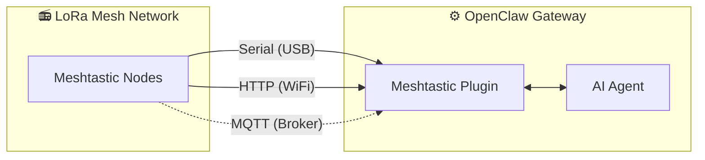

# MeshClaw: OpenClaw Meshtastic チャンネルプラグイン

<p align="center">
  <a href="https://www.npmjs.com/package/@seeed-studio/meshtastic">
    
  </a>
  <a href="https://www.npmjs.com/package/@seeed-studio/meshtastic">
    
  </a>
</p>

<!-- LANG_SWITCHER_START -->
<p align="center">
  <a href="README.md">English</a> | <a href="README.zh-CN.md">中文</a> | <b>日本語</b> | <a href="README.fr.md">Français</a> | <a href="README.pt.md">Português</a> | <a href="README.es.md">Español</a>
</p>
<!-- LANG_SWITCHER_END -->

MeshClaw は、OpenClaw のチャンネルプラグインで、Meshtastic 経由で AI ゲートウェイがメッセージを送受信できるようにします — インターネットも携帯基地局も不要、使うのは電波だけ。山でも海でも、電力網の届かない場所からでも AI アシスタントと話せます。

⭐ GitHub でスターをお願いします — とても励みになります！

> [!IMPORTANT]
> これは OpenClaw（[OpenClaw](https://github.com/openclaw/openclaw)）AIゲートウェイ用のチャンネルプラグインであり、単体アプリではありません。利用するには OpenClaw の実行環境（Node.js 22+）が必要です。

[ドキュメント][docs] · [ハードウェアガイド](#recommended-hardware) · [バグ報告][issues] · [機能要望][issues]

## 目次

- [仕組み](#仕組み)
- [推奨ハードウェア](#推奨ハードウェア)
- [特徴](#特徴)
- [機能とロードマップ](#機能とロードマップ)
- [デモ](#デモ)
- [クイックスタート](#クイックスタート)
- [セットアップウィザード](#セットアップウィザード)
- [設定](#1-トランスポート)
- [トラブルシューティング](#2-lora-地域)
- [開発](#3-ノード名)
- [貢献](#4-チャネルアクセスgrouppolicy)

<a id="how-it-works"></a>
## 仕組み



このプラグインは、Meshtastic の LoRa デバイスと OpenClaw の AI エージェントを橋渡しします。3つのトランスポートモードをサポートします:

- Serial — ローカルの Meshtastic デバイスへ USB で直接接続
- HTTP — WiFi/ローカルネットワーク経由でデバイスに接続
- MQTT — Meshtastic の MQTT ブローカーを購読。ローカルハードウェア不要

受信メッセージは、AI に届く前にアクセス制御（DM ポリシー、グループポリシー、メンション必須）を通ります。送信返信は Markdown を除去（LoRa デバイスでは表示不可）し、電波パケットサイズの制限に収まるよう分割されます。

<a id="recommended-hardware"></a>
## 推奨ハードウェア

<p align="center">
  
</p>

| デバイス                         | 用途                      | リンク            |
| -------------------------------- | ------------------------- | ----------------- |
| XIAO ESP32S3 + Wio-SX1262 キット | 入門向け開発              | [購入][hw-xiao]   |
| Wio Tracker L1 Pro               | 携行型フィールドゲートウェイ | [購入][hw-wio]    |
| SenseCAP Card Tracker T1000-E    | 小型トラッカー            | [購入][hw-sensecap] |

ハードウェアがありませんか？MQTT トランスポートならブローカー経由で接続できます — ローカルデバイスは不要です。

Meshtastic 互換デバイスならどれでも動作します。

<a id="features"></a>
## 特徴

- AI エージェント統合 — OpenClaw の AI エージェントと Meshtastic の LoRa メッシュネットワークを橋渡し。クラウドに依存しないインテリジェントな通信を実現。
- 3つのトランスポートモード — Serial（USB）、HTTP（WiFi）、MQTT に対応
- アクセス制御付きの DM とグループチャネル — DM 許可リスト、チャネル応答ルール、メンション必須設定に対応
- マルチアカウント対応 — 複数の独立接続を同時稼働
- 堅牢なメッシュ通信 — 設定可能なリトライ付きの自動再接続。切断にも強い設計。

<a id="capabilities--roadmap"></a>
## 機能とロードマップ

このプラグインは Meshtastic を Telegram や Discord と同等の一級チャンネルとして扱い、インターネットに依存せず、LoRa 無線のみで AI との会話やスキル呼び出しを可能にします。

| オフラインで情報を照会                                      | クロスチャネルブリッジ：オフグリッドから送信し、どこでも受信 | 🔜 次に予定していること                                      |
| ----------------------------------------------------------- | ------------------------------------------------------------ | ------------------------------------------------------------ |
|  |    | リアルタイムのノードデータ（GPS 位置、環境センサー、デバイス状態）を OpenClaw のコンテキストに取り込み、ユーザーからの問い合わせを待たずに、AI がメッシュネットワークの健全性を監視して能動的にアラートを配信できるようにする計画です。 |

<a id="demo"></a>
## デモ

<div align="center">

https://github.com/user-attachments/assets/837062d9-a5bb-4e0a-b7cf-298e4bdf2f7c

</div>

代替: [media/demo.mp4](media/demo.mp4)

<a id="quick-start"></a>
## クイックスタート

```bash
# 1. Install plugin
openclaw plugins install @seeed-studio/meshtastic

# 2. Guided setup — walks you through transport, region, and access policy
openclaw onboard

# 3. Verify
openclaw channels status --probe
```

<p align="center">
  
</p>

<a id="setup-wizard"></a>
## セットアップウィザード

`openclaw onboard` を実行すると、各設定手順を案内する対話式ウィザードが起動します。以下は各ステップの意味と選び方です。

### 1. トランスポート

ゲートウェイが Meshtastic メッシュへ接続する方法:

| オプション            | 説明                                                     | 要件                                                |
| --------------------- | -------------------------------------------------------- | --------------------------------------------------- |
| Serial（USB）         | ローカルデバイスへ USB で直接接続。利用可能ポートを自動検出。 | Meshtastic デバイスを USB で接続                     |
| HTTP（WiFi）          | ローカルネットワーク越しにデバイスへ接続。               | デバイスの IP またはホスト名（例 `meshtastic.local`） |
| MQTT（ブローカー）    | MQTT ブローカー経由でメッシュに接続 — ローカル HW 不要。 | ブローカーのアドレス、認証情報、購読トピック         |

### 2. LoRa 地域

> Serial と HTTP のみ。MQTT は購読トピックから地域を推定します。

デバイスの無線周波数地域を設定します。各国の規制およびメッシュ上の他ノードと一致させる必要があります。主な選択肢:

| 地域     | 周波数            |
| -------- | ----------------- |
| `US`     | 902–928 MHz       |
| `EU_868` | 869 MHz           |
| `CN`     | 470–510 MHz       |
| `JP`     | 920 MHz           |
| `UNSET`  | デバイス既定を維持 |

全リストは [Meshtastic の地域ドキュメント](https://meshtastic.org/docs/getting-started/initial-config/#lora)を参照してください。

### 3. ノード名

メッシュ上でのデバイス表示名。グループチャネルでの@メンションのトリガーとしても使用されます（例: `@OpenClaw`）。

- Serial / HTTP: 任意 — 空の場合は接続デバイスから自動検出します。
- MQTT: 必須 — 参照できる物理デバイスがありません。

### 4. チャネルアクセス（`groupPolicy`）

メッシュのグループチャネル（例: LongFast, Emergency）で、ボットが応答するか・どのように応答するかを制御します:

| ポリシー              | 動作                                                         |
| --------------------- | ------------------------------------------------------------ |
| `disabled`（既定）    | すべてのグループチャネルを無視。DM のみ処理。                |
| `open`                | メッシュ上のあらゆるチャネルで応答。                         |
| `allowlist`           | 指定したチャネルでのみ応答。入力時にチャネル名（カンマ区切り、例 `LongFast, Emergency`）を指定。`*` で全一致のワイルドカード。 |

### 5. メンション必須

> チャネルアクセスが有効（`disabled` 以外）な場合のみ表示されます。

有効（既定: はい）の場合、グループチャネルでは、誰かがノード名をメンションしたときのみボットが応答します（例: `@OpenClaw 今の天気は？`）。これにより、チャネル内の全メッセージに反応してしまうのを防げます。

無効にすると、許可されたチャネル内のすべてのメッセージに応答します。

### 6. DM アクセスポリシー（`dmPolicy`）

誰がボットにダイレクトメッセージを送れるかを制御します:

| ポリシー             | 動作                                                         |
| -------------------- | ------------------------------------------------------------ |
| `pairing`（既定）    | 新しい送信者はペアリング要求をトリガー。承認後にチャット可能。 |
| `open`               | メッシュ上の誰でも自由に DM 可能。                           |
| `allowlist`          | `allowFrom` に記載のノードのみ DM を許可。その他は無視。     |

### 7. DM 許可リスト（`allowFrom`）

> `dmPolicy` が `allowlist` の場合、またはウィザードが必要と判断した場合に表示されます。

DM を送信できる Meshtastic ユーザー ID の一覧。形式: `!aabbccdd`（16進 User ID）。複数指定はカンマ区切り。

<p align="center">
  
</p>

### 8. アカウント表示名

> マルチアカウント設定時にのみ表示。任意。

アカウントに人間が読みやすい表示名を割り当てます。たとえば ID が `home` のアカウントを「Home Station」と表示できます。省略した場合は元のアカウント ID をそのまま使用。機能には影響しない見た目のみの設定です。

<a id="configuration"></a>
## 設定

ガイド付きセットアップ（`openclaw onboard`）で以下の内容はすべて設定できます。手順は[セットアップウィザード](#setup-wizard)を参照。手動設定する場合は `openclaw config edit` を使用します。

### Serial（USB）

```yaml
channels:
  meshtastic:
    transport: serial
    serialPort: /dev/ttyUSB0
    nodeName: OpenClaw
```

### HTTP（WiFi）

```yaml
channels:
  meshtastic:
    transport: http
    httpAddress: meshtastic.local
    nodeName: OpenClaw
```

### MQTT（ブローカー）

```yaml
channels:
  meshtastic:
    transport: mqtt
    nodeName: OpenClaw
    mqtt:
      broker: mqtt.meshtastic.org
      username: meshdev
      password: large4cats
      topic: "msh/US/2/json/#"
```

### マルチアカウント

```yaml
channels:
  meshtastic:
    accounts:
      home:
        transport: serial
        serialPort: /dev/ttyUSB0
      remote:
        transport: mqtt
        mqtt:
          broker: mqtt.meshtastic.org
          topic: "msh/US/2/json/#"
```

<details>
<summary><b>全オプションリファレンス</b></summary>

| キー                  | 型                              | 既定                  | 備考                                                         |
| --------------------- | ------------------------------- | --------------------- | ------------------------------------------------------------ |
| `transport`           | `serial \| http \| mqtt`        | `serial`              |                                                              |
| `serialPort`          | `string`                        | —                     | Serial の場合は必須                                          |
| `httpAddress`         | `string`                        | `meshtastic.local`    | HTTP の場合は必須                                            |
| `httpTls`             | `boolean`                       | `false`               |                                                              |
| `mqtt.broker`         | `string`                        | `mqtt.meshtastic.org` |                                                              |
| `mqtt.port`           | `number`                        | `1883`                |                                                              |
| `mqtt.username`       | `string`                        | `meshdev`             |                                                              |
| `mqtt.password`       | `string`                        | `large4cats`          |                                                              |
| `mqtt.topic`          | `string`                        | `msh/US/2/json/#`     | 購読トピック                                                 |
| `mqtt.publishTopic`   | `string`                        | derived               |                                                              |
| `mqtt.tls`            | `boolean`                       | `false`               |                                                              |
| `region`              | enum                            | `UNSET`               | `US`, `EU_868`, `CN`, `JP`, `ANZ`, `KR`, `TW`, `RU`, `IN`, `NZ_865`, `TH`, `EU_433`, `UA_433`, `UA_868`, `MY_433`, `MY_919`, `SG_923`, `LORA_24`。Serial/HTTP のみ。 |
| `nodeName`            | `string`                        | 自動検出              | 表示名かつ @メンショントリガー。MQTT では必須。              |
| `dmPolicy`            | `open \| pairing \| allowlist`  | `pairing`             | DM を送れる範囲。[DM アクセスポリシー](#6-dm-access-policy-dmpolicy)参照。 |
| `allowFrom`           | `string[]`                      | —                     | DM 許可リストのノード ID。例 `["!aabbccdd"]`                 |
| `groupPolicy`         | `open \| allowlist \| disabled` | `disabled`            | グループチャネルでの応答ポリシー。[チャネルアクセス](#4-channel-access-grouppolicy)参照。 |
| `channels`            | `Record<string, object>`        | —                     | チャネル単位の上書き: `requireMention`, `allowFrom`, `tools` |

</details>

<details>
<summary><b>環境変数での上書き</b></summary>

これらはデフォルトアカウントの設定を上書きします（名前付きアカウントは YAML が優先されます）:

| 環境変数                   | 対応する設定キー  |
| -------------------------- | ----------------- |
| `MESHTASTIC_TRANSPORT`     | `transport`       |
| `MESHTASTIC_SERIAL_PORT`   | `serialPort`      |
| `MESHTASTIC_HTTP_ADDRESS`  | `httpAddress`     |
| `MESHTASTIC_MQTT_BROKER`   | `mqtt.broker`     |
| `MESHTASTIC_MQTT_TOPIC`    | `mqtt.topic`      |

</details>

<a id="troubleshooting"></a>
## トラブルシューティング

| 症状                    | 確認ポイント                                                  |
| ----------------------- | ------------------------------------------------------------- |
| Serial に接続できない   | デバイスパスは正しいか？ホストの権限は足りているか？          |
| HTTP に接続できない     | `httpAddress` に到達できるか？`httpTls` はデバイスと一致か？  |
| MQTT が受信しない       | `mqtt.topic` の地域指定は正しいか？ブローカー認証は有効か？   |
| DM に応答しない         | `dmPolicy` と `allowFrom` は設定済みか？[DM アクセス](#6-dm-access-policy-dmpolicy)参照。 |
| グループで応答しない     | `groupPolicy` は有効か？チャネルは許可リストにあるか？メンション必須か？[チャネルアクセス](#4-channel-access-grouppolicy)参照。 |

バグを見つけましたか？トランスポートの種類、設定（秘密はマスク）、`openclaw channels status --probe` の出力を添えて[Issue を作成][issues]してください。

<a id="development"></a>
## 開発

```bash
git clone https://github.com/Seeed-Solution/MeshClaw.git
cd MeshClaw
npm install
openclaw plugins install -l ./MeshClaw
```

ビルド工程は不要 — OpenClaw は TypeScript のソースを直接読み込みます。`openclaw channels status --probe` で確認してください。

<a id="contributing"></a>
## 貢献

- バグ報告や機能要望は[Issue を作成][issues]
- プルリク歓迎 — 既存の TypeScript コーディング規約に合わせてください

<!-- Reference-style links -->
[docs]: https://meshtastic.org/docs/
[issues]: https://github.com/Seeed-Solution/MeshClaw/issues
[hw-xiao]: https://www.seeedstudio.com/Wio-SX1262-with-XIAO-ESP32S3-p-5982.html
[hw-wio]: https://www.seeedstudio.com/Wio-Tracker-L1-Pro-p-6454.html
[hw-sensecap]: https://www.seeedstudio.com/SenseCAP-Card-Tracker-T1000-E-for-Meshtastic-p-5913.html