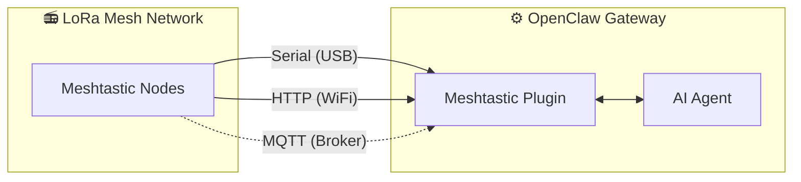

# MeshClaw: Plugin de Canal Meshtastic para OpenClaw

<p align="center">
  <a href="https://www.npmjs.com/package/@seeed-studio/meshtastic">
    
  </a>
  <a href="https://www.npmjs.com/package/@seeed-studio/meshtastic">
    
  </a>
</p>

<!-- LANG_SWITCHER_START -->
<p align="center">
  <a href="README.md">English</a> | <a href="README.zh-CN.md">中文</a> | <a href="README.ja.md">日本語</a> | <a href="README.fr.md">Français</a> | <b>Português</b> | <a href="README.es.md">Español</a>
</p>
<!-- LANG_SWITCHER_END -->

O MeshClaw é um plugin de canal do OpenClaw que permite ao seu gateway de IA enviar e receber mensagens via Meshtastic — sem internet, sem torres de celular, apenas ondas de rádio. Converse com seu assistente de IA das montanhas, do oceano ou de qualquer lugar onde a rede não chega.

⭐ Dê uma estrela no GitHub — isso nos motiva muito!

> [!IMPORTANT]
> Este é um plugin de canal para o gateway de IA [OpenClaw](https://github.com/openclaw/openclaw) — não é um aplicativo independente. Você precisa de uma instância do OpenClaw em execução (Node.js 22+) para usá-lo.

[Documentação][docs] · [Guia de Hardware](#hardware-recomendado) · [Reportar Problema][issues] · [Solicitar Recurso][issues]

## Sumário

- [Como Funciona](#como-funciona)
- [Hardware Recomendado](#hardware-recomendado)
- [Recursos](#recursos)
- [Capacidades e Roteiro](#capacidades-e-roteiro)
- [Demonstração](#demonstração)
- [Início Rápido](#início-rápido)
- [Assistente de Configuração](#assistente-de-configuração)
- [Configuração](#1-transporte)
- [Solução de Problemas](#2-região-lora)
- [Desenvolvimento](#3-nome-do-nó)
- [Contribuindo](#4-acesso-a-canais-grouppolicy)

## Como Funciona



O plugin faz a ponte entre dispositivos LoRa Meshtastic e o agente de IA do OpenClaw. Ele suporta três modos de transporte:

- Serial — conexão USB direta com um dispositivo Meshtastic local
- HTTP — conecta-se a um dispositivo via Wi-Fi / rede local
- MQTT — assina um broker MQTT do Meshtastic, sem necessidade de hardware local

Mensagens de entrada passam por controle de acesso (política de DM, política de grupo, exigência de menção) antes de chegar à IA. As respostas de saída têm a formatação Markdown removida (os dispositivos LoRa não a renderizam) e são fragmentadas para caber nos limites de tamanho dos pacotes de rádio.

## Hardware Recomendado

<p align="center">
  
</p>

| Dispositivo                    | Melhor para              | Link            |
| ----------------------------- | ------------------------ | --------------- |
| XIAO ESP32S3 + Wio-SX1262 kit | Desenvolvimento inicial  | [Comprar][hw-xiao]     |
| Wio Tracker L1 Pro            | Gateway de campo portátil | [Comprar][hw-wio]      |
| SenseCAP Card Tracker T1000-E | Rastreador compacto      | [Comprar][hw-sensecap] |

Sem hardware? O transporte via MQTT conecta-se através do broker — nenhum dispositivo local é necessário.

Qualquer dispositivo compatível com Meshtastic funciona.

## Recursos

- Integração com Agente de IA — Faz a ponte entre agentes de IA do OpenClaw e redes de malha LoRa Meshtastic. Habilita comunicação inteligente sem dependência da nuvem.

- Três Modos de Transporte — Suporte a Serial (USB), HTTP (Wi-Fi) e MQTT

- Canais de DM e Grupo com Controle de Acesso — Suporta ambos os modos de conversa com listas de permissão para DMs, regras de resposta por canal e exigência de menção

- Suporte a Múltiplas Contas — Execute várias conexões independentes simultaneamente

- Comunicação Resiliente na Malha — Reconexão automática com tentativas configuráveis. Lida bem com quedas de conexão.

## Capacidades e Roteiro

O plugin trata o Meshtastic como um canal de primeira classe — como Telegram ou Discord — permitindo conversas com IA e invocação de habilidades inteiramente via rádio LoRa, sem dependência de internet.

| Consultar Informações Offline                               | Ponte entre Canais: Envie fora da rede, receba em qualquer lugar | 🔜 Próximos passos:                                           |
| ----------------------------------------------------------- | --------------------------------------------------------------- | ------------------------------------------------------------- |
|  |           | Planejamos ingerir dados em tempo real dos nós (localização GPS, sensores ambientais, status do dispositivo) no contexto do OpenClaw, permitindo que a IA monitore a saúde da rede de malha e transmita alertas proativos sem esperar por perguntas dos usuários. |

## Demonstração

<div align="center">

https://github.com/user-attachments/assets/837062d9-a5bb-4e0a-b7cf-298e4bdf2f7c

</div>

Alternativa: [media/demo.mp4](media/demo.mp4)

## Início Rápido

```bash
# 1. Install plugin
openclaw plugins install @seeed-studio/meshtastic

# 2. Guided setup — walks you through transport, region, and access policy
openclaw onboard

# 3. Verify
openclaw channels status --probe
```

<p align="center">
  
</p>

## Assistente de Configuração

Executar `openclaw onboard` inicia um assistente interativo que guia você por cada etapa de configuração. Abaixo está o significado de cada etapa e como escolher.

### 1. Transporte

Como o gateway se conecta à malha Meshtastic:

| Opção             | Descrição                                                     | Requisitos                                        |
| ----------------- | ------------------------------------------------------------- | ------------------------------------------------- |
| Serial (USB)      | Conexão USB direta a um dispositivo local. Detecta portas automaticamente. | Dispositivo Meshtastic conectado via USB          |
| HTTP (Wi-Fi)      | Conecta a um dispositivo na rede local.                       | IP ou hostname do dispositivo (ex.: `meshtastic.local`) |
| MQTT (broker)     | Conecta à malha via um broker MQTT — sem necessidade de hardware local. | Endereço do broker, credenciais e tópico de assinatura |

### 2. Região LoRa

> Somente Serial e HTTP. O MQTT obtém a região a partir do tópico de assinatura.

Define a região de frequência de rádio no dispositivo. Deve corresponder às regulamentações locais e aos outros nós da malha. Opções comuns:

| Região   | Frequência          |
| -------- | ------------------- |
| US       | 902–928 MHz         |
| EU_868   | 869 MHz             |
| CN       | 470–510 MHz         |
| JP       | 920 MHz             |
| UNSET    | Manter padrão do dispositivo |

Veja a [documentação de regiões do Meshtastic](https://meshtastic.org/docs/getting-started/initial-config/#lora) para a lista completa.

### 3. Nome do Nó

O nome de exibição do dispositivo na malha. Também é usado como o gatilho de @menção em canais de grupo — outros usuários enviam `@OpenClaw` para falar com seu bot.

- Serial / HTTP: opcional — detecta automaticamente do dispositivo conectado se deixar em branco.
- MQTT: obrigatório — não há dispositivo físico do qual ler o nome.

### 4. Acesso a Canais (groupPolicy)

Controla se e como o bot responde em canais de grupo da malha (por exemplo, LongFast, Emergency):

| Política            | Comportamento                                                |
| ------------------- | ------------------------------------------------------------ |
| `disabled` (padrão) | Ignora todas as mensagens de canais de grupo. Somente DMs são processadas. |
| `open`              | Responde em todos os canais da malha.                       |
| `allowlist`         | Responde apenas nos canais listados. Você será solicitado a informar os nomes dos canais (separados por vírgulas, ex.: `LongFast, Emergency`). Use `*` como curinga para corresponder a todos. |

### 5. Exigir Menção

> Aparece apenas quando o acesso a canais está habilitado (não `disabled`).

Quando habilitado (padrão: sim), o bot só responde em canais de grupo quando alguém menciona seu nome de nó (ex.: `@OpenClaw como está o tempo?`). Isso evita que o bot responda a todas as mensagens do canal.

Quando desabilitado, o bot responde a todas as mensagens nos canais permitidos.

### 6. Política de Acesso a DM (dmPolicy)

Controla quem pode enviar mensagens diretas ao bot:

| Política           | Comportamento                                                 |
| ------------------ | ------------------------------------------------------------- |
| `pairing` (padrão) | Novos remetentes disparam um pedido de pareamento que deve ser aprovado antes de poderem conversar. |
| `open`             | Qualquer pessoa na malha pode enviar DMs livremente.         |
| `allowlist`        | Somente nós listados em `allowFrom` podem enviar DM. Todos os outros são ignorados. |

### 7. Lista de Permissões de DM (allowFrom)

> Aparece apenas quando `dmPolicy` é `allowlist`, ou quando o assistente determina que é necessário.

Uma lista de IDs de Usuário Meshtastic autorizados a enviar mensagens diretas. Formato: `!aabbccdd` (ID de usuário em hex). Entradas múltiplas são separadas por vírgulas.

<p align="center">
  
</p>

### 8. Nomes de Exibição das Contas

> Aparece apenas para configurações com várias contas. Opcional.

Atribui nomes amigáveis às suas contas. Por exemplo, uma conta com ID `home` pode ser exibida como "Estação Casa". Se ignorado, o ID bruto da conta é usado como está. Isso é puramente cosmético e não afeta a funcionalidade.

## Configuração

A configuração guiada (`openclaw onboard`) cobre tudo abaixo. Veja o [Assistente de Configuração](#assistente-de-configuração) para um passo a passo. Para configurar manualmente, edite com `openclaw config edit`.

### Serial (USB)

```yaml
channels:
  meshtastic:
    transport: serial
    serialPort: /dev/ttyUSB0
    nodeName: OpenClaw
```

### HTTP (Wi-Fi)

```yaml
channels:
  meshtastic:
    transport: http
    httpAddress: meshtastic.local
    nodeName: OpenClaw
```

### MQTT (broker)

```yaml
channels:
  meshtastic:
    transport: mqtt
    nodeName: OpenClaw
    mqtt:
      broker: mqtt.meshtastic.org
      username: meshdev
      password: large4cats
      topic: "msh/US/2/json/#"
```

### Várias contas

```yaml
channels:
  meshtastic:
    accounts:
      home:
        transport: serial
        serialPort: /dev/ttyUSB0
      remote:
        transport: mqtt
        mqtt:
          broker: mqtt.meshtastic.org
          topic: "msh/US/2/json/#"
```

<details>
<summary><b>Referência de Todas as Opções</b></summary>

| Chave               | Tipo                           | Padrão               | Observações                                                |
| ------------------- | ------------------------------ | -------------------- | ---------------------------------------------------------- |
| `transport`         | `serial \| http \| mqtt`       | `serial`             |                                                            |
| `serialPort`        | `string`                       | —                    | Obrigatório para serial                                    |
| `httpAddress`       | `string`                       | `meshtastic.local`   | Obrigatório para HTTP                                      |
| `httpTls`           | `boolean`                      | `false`              |                                                            |
| `mqtt.broker`       | `string`                       | `mqtt.meshtastic.org`|                                                            |
| `mqtt.port`         | `number`                       | `1883`               |                                                            |
| `mqtt.username`     | `string`                       | `meshdev`            |                                                            |
| `mqtt.password`     | `string`                       | `large4cats`         |                                                            |
| `mqtt.topic`        | `string`                       | `msh/US/2/json/#`    | Tópico de assinatura                                       |
| `mqtt.publishTopic` | `string`                       | derivado             |                                                            |
| `mqtt.tls`          | `boolean`                      | `false`              |                                                            |
| `region`            | enum                           | `UNSET`              | `US`, `EU_868`, `CN`, `JP`, `ANZ`, `KR`, `TW`, `RU`, `IN`, `NZ_865`, `TH`, `EU_433`, `UA_433`, `UA_868`, `MY_433`, `MY_919`, `SG_923`, `LORA_24`. Apenas Serial/HTTP. |
| `nodeName`          | `string`                       | auto-detect          | Nome de exibição e gatilho de @menção. Obrigatório para MQTT. |
| `dmPolicy`          | `open \| pairing \| allowlist` | `pairing`            | Quem pode enviar mensagens diretas. Veja [Política de Acesso a DM](#6-política-de-acesso-a-dm-dmpolicy). |
| `allowFrom`         | `string[]`                     | —                    | IDs de nós para a lista de permissões de DM, ex.: `["!aabbccdd"]` |
| `groupPolicy`       | `open \| allowlist \| disabled`| `disabled`           | Política de resposta em canais de grupo. Veja [Acesso a Canais](#4-acesso-a-canais-grouppolicy). |
| `channels`          | `Record<string, object>`       | —                    | Substituições por canal: `requireMention`, `allowFrom`, `tools` |

</details>

<details>
<summary><b>Substituições por Variáveis de Ambiente</b></summary>

Estas substituem a configuração da conta padrão (o YAML tem precedência para contas nomeadas):

| Variável                   | Chave de config equivalente |
| ------------------------- | --------------------------- |
| `MESHTASTIC_TRANSPORT`    | `transport`                 |
| `MESHTASTIC_SERIAL_PORT`  | `serialPort`                |
| `MESHTASTIC_HTTP_ADDRESS` | `httpAddress`               |
| `MESHTASTIC_MQTT_BROKER`  | `mqtt.broker`               |
| `MESHTASTIC_MQTT_TOPIC`   | `mqtt.topic`                |

</details>

## Solução de Problemas

| Sintoma              | Verifique                                                    |
| -------------------- | ------------------------------------------------------------ |
| Serial não conecta   | Caminho do dispositivo correto? O host tem permissão?        |
| HTTP não conecta     | `httpAddress` acessível? `httpTls` corresponde ao do dispositivo? |
| MQTT não recebe nada | Região em `mqtt.topic` correta? Credenciais do broker válidas? |
| Sem respostas em DM  | `dmPolicy` e `allowFrom` configurados? Veja [Política de Acesso a DM](#6-política-de-acesso-a-dm-dmpolicy). |
| Sem respostas em grupo | `groupPolicy` habilitada? Canal na lista de permissões? Menção exigida? Veja [Acesso a Canais](#4-acesso-a-canais-grouppolicy). |

Encontrou um bug? [Abra uma issue][issues] com o tipo de transporte, configuração (redija segredos) e a saída de `openclaw channels status --probe`.

## Desenvolvimento

```bash
git clone https://github.com/Seeed-Solution/MeshClaw.git
cd MeshClaw
npm install
openclaw plugins install -l ./MeshClaw
```

Sem etapa de build — o OpenClaw carrega o código-fonte TypeScript diretamente. Use `openclaw channels status --probe` para verificar.

## Contribuindo

- [Abra uma issue][issues] para bugs ou pedidos de recursos
- Pull requests são bem-vindos — mantenha o código alinhado com as convenções existentes de TypeScript

<!-- Links em estilo de referência -->
[docs]: https://meshtastic.org/docs/
[issues]: https://github.com/Seeed-Solution/MeshClaw/issues
[hw-xiao]: https://www.seeedstudio.com/Wio-SX1262-with-XIAO-ESP32S3-p-5982.html
[hw-wio]: https://www.seeedstudio.com/Wio-Tracker-L1-Pro-p-6454.html
[hw-sensecap]: https://www.seeedstudio.com/SenseCAP-Card-Tracker-T1000-E-for-Meshtastic-p-5913.html