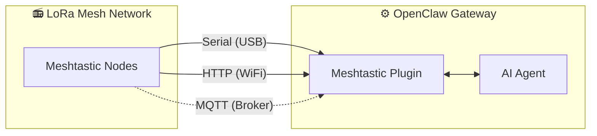

# MeshClaw：OpenClaw Meshtastic 频道插件

<p align="center">
  <a href="https://www.npmjs.com/package/@seeed-studio/meshtastic">
    
  </a>
  <a href="https://www.npmjs.com/package/@seeed-studio/meshtastic">
    
  </a>
</p>

<!-- LANG_SWITCHER_START -->
<p align="center">
  <a href="README.md">English</a> | <b>中文</b> | <a href="README.ja.md">日本語</a> | <a href="README.fr.md">Français</a> | <a href="README.pt.md">Português</a> | <a href="README.es.md">Español</a>
</p>
<!-- LANG_SWITCHER_END -->

MeshClaw 是一个 OpenClaw 频道插件，让你的 AI 网关通过 Meshtastic 发送和接收消息——无需互联网、无需蜂窝网络，只靠电波。在山里、海上，或任何不在电网覆盖范围的地方，都能与 AI 助手沟通。

⭐ 欢迎在 GitHub 上为我们点 Star——这对我们很有激励！

> [!IMPORTANT]
> 这是用于 [OpenClaw](https://github.com/openclaw/openclaw) AI 网关的“频道插件”，并非独立应用。使用前需要一个已运行的 OpenClaw 实例（Node.js 22+）。

[文档][docs] · [硬件指南](#recommended-hardware) · [提交 Bug][issues] · [功能请求][issues]

## 目录

- [工作原理](#工作原理)
- [推荐硬件](#推荐硬件)
- [功能](#功能)
- [能力与路线图](#能力与路线图)
- [演示](#演示)
- [快速开始](#快速开始)
- [设置向导](#设置向导)
- [配置](#1-传输方式)
- [故障排查](#2-lora-区域)
- [开发](#3-节点名称)
- [贡献](#4-频道访问grouppolicy)

## 工作原理



该插件在 Meshtastic LoRa 设备与 OpenClaw AI 代理之间建立桥接。支持三种传输模式：

- 串口（Serial）——通过 USB 直连本地 Meshtastic 设备
- HTTP ——通过 WiFi/局域网连接设备
- MQTT ——订阅 Meshtastic MQTT 代理，无需本地硬件

入站消息会经过访问控制（私信策略、群组策略、@提及门槛）后再交给 AI。出站回复会移除 Markdown 格式（LoRa 设备无法渲染），并按无线电数据包大小限制进行分片发送。

## 推荐硬件

<p align="center">
  
</p>

| 设备                         | 最佳用途               | 链接               |
| ---------------------------- | ---------------------- | ------------------ |
| XIAO ESP32S3 + Wio-SX1262 套件 | 入门级开发             | [购买][hw-xiao]    |
| Wio Tracker L1 Pro           | 便携式现场网关         | [购买][hw-wio]     |
| SenseCAP Card Tracker T1000-E | 小型追踪器             | [购买][hw-sensecap] |

没有硬件？可使用 MQTT 传输通过代理连接——无需本地设备。

任何兼容 Meshtastic 的设备都可以使用。

## 功能

- AI 代理集成——将 OpenClaw AI 代理与 Meshtastic LoRa Mesh 网络桥接，实现无云依赖的智能通信。

- 三种传输模式——支持串口（USB）、HTTP（WiFi）与 MQTT

- 私信与群组频道的访问控制——支持两种会话模式，提供私信白名单、频道响应规则与@提及门槛

- 多账号支持——可同时运行多个独立连接

- 稳健的 Mesh 通信——可配置自动重连与重试，优雅应对掉线与中断

## 能力与路线图

该插件将 Meshtastic 视为一等公民的通讯渠道——就像 Telegram 或 Discord 一样——使 AI 对话与工具调用完全通过 LoRa 无线电进行，无需依赖互联网。

| 离线查询信息                                            | 跨渠道桥接：离网发送，任意处接收                        | 🔜 接下来：                                                |
| ------------------------------------------------------- | ------------------------------------------------------- | --------------------------------------------------------- |
|        |          | 我们计划将实时节点数据（GPS 位置、环境传感、设备状态）注入 OpenClaw 上下文，让 AI 能监控 Mesh 网络健康状况，并主动广播告警，而无需等待用户发问。 |

## 演示

<div align="center">

https://github.com/user-attachments/assets/837062d9-a5bb-4e0a-b7cf-298e4bdf2f7c

</div>

备用视频： [media/demo.mp4](media/demo.mp4)

## 快速开始

```bash
# 1. Install plugin
openclaw plugins install @seeed-studio/meshtastic

# 2. Guided setup — walks you through transport, region, and access policy
openclaw onboard

# 3. Verify
openclaw channels status --probe
```

<p align="center">
  
</p>

## 设置向导

运行 `openclaw onboard` 会启动交互式向导，引导你完成每一步配置。下面解释每一步的含义与选择建议。

### 1. 传输方式

网关如何连接到 Meshtastic Mesh：

| 选项               | 说明                                                          | 要求                                           |
| ------------------ | ------------------------------------------------------------- | ---------------------------------------------- |
| 串口（Serial，USB） | 通过 USB 直连本地设备。可自动检测可用端口。                    | 通过 USB 连接的 Meshtastic 设备                |
| HTTP（WiFi）       | 通过局域网连接设备。                                           | 设备 IP 或主机名（如 `meshtastic.local`）      |
| MQTT（代理）       | 通过 MQTT 代理接入 Mesh——无需本地硬件。                         | 代理地址、凭据与订阅主题                       |

### 2. LoRa 区域

> 仅适用于串口与 HTTP。MQTT 会根据订阅主题推导区域。

设置设备的无线频段区域。必须符合当地法规，并与 Mesh 上其他节点一致。常见选项：

| 区域     | 频段               |
| -------- | ------------------ |
| `US`     | 902–928 MHz        |
| `EU_868` | 869 MHz            |
| `CN`     | 470–510 MHz        |
| `JP`     | 920 MHz            |
| `UNSET`  | 保持设备默认       |

完整列表参见 [Meshtastic 区域文档](https://meshtastic.org/docs/getting-started/initial-config/#lora)。

### 3. 节点名称

设备在 Mesh 上的显示名称。也作为群组频道中的“@提及触发词”——其他用户发送 `@OpenClaw` 与机器人对话。

- 串口/HTTP：可选——若留空，将自动从连接的设备读取名称。
- MQTT：必填——因为没有实体设备可读取名称。

### 4. 频道访问（groupPolicy）

控制机器人在“Mesh 群组频道”（如 LongFast、Emergency）中的响应策略：

| 策略                 | 行为说明                                                     |
| -------------------- | ------------------------------------------------------------ |
| `disabled`（默认）   | 忽略所有群组频道消息。仅处理私信。                           |
| `open`               | 在 Mesh 上的“所有”频道中响应。                               |
| `allowlist`          | 仅在“列出的”频道中响应。会提示输入频道名（逗号分隔，如 `LongFast, Emergency`）。使用 `*` 作为通配符匹配全部。 |

### 5. 需要 @提及

> 仅当频道访问已启用（非 `disabled`）时出现。

启用时（默认：是），机器人只在群组频道里被@到其节点名时才回应（例如 `@OpenClaw 天气怎么样？`）。这可避免机器人对频道中每一条消息都做出回复。

若关闭，则机器人会在允许的频道中对“所有”消息回复。

### 6. 私信访问策略（dmPolicy）

控制谁可以给机器人发送“私信”：

| 策略                 | 行为说明                                                     |
| -------------------- | ------------------------------------------------------------ |
| `pairing`（默认）    | 新发送者会触发配对请求，需先批准后才能聊天。                 |
| `open`               | Mesh 上任何人都可以自由私信机器人。                          |
| `allowlist`          | 只有 `allowFrom` 列表中的节点可以私信。其他一律忽略。        |

### 7. 私信白名单（allowFrom）

> 仅当 `dmPolicy` 为 `allowlist`，或向导判定需要时出现。

允许发送私信的 Meshtastic 用户 ID 列表。格式：`!aabbccdd`（16 进制用户 ID）。多个条目用逗号分隔。

<p align="center">
  
</p>

### 8. 账号显示名称

> 仅对多账号配置显示。可选。

为你的账号分配易读的显示名称。比如，将 ID 为 `home` 的账号显示为 “Home Station”。若跳过，将直接使用原始账号 ID。仅用于显示，不影响功能。

## 配置

引导式设置（`openclaw onboard`）已覆盖以下所有内容。详见[设置向导](#setup-wizard)。若需手动配置，可用 `openclaw config edit` 编辑。

### 串口（USB）

```yaml
channels:
  meshtastic:
    transport: serial
    serialPort: /dev/ttyUSB0
    nodeName: OpenClaw
```

### HTTP（WiFi）

```yaml
channels:
  meshtastic:
    transport: http
    httpAddress: meshtastic.local
    nodeName: OpenClaw
```

### MQTT（代理）

```yaml
channels:
  meshtastic:
    transport: mqtt
    nodeName: OpenClaw
    mqtt:
      broker: mqtt.meshtastic.org
      username: meshdev
      password: large4cats
      topic: "msh/US/2/json/#"
```

### 多账号

```yaml
channels:
  meshtastic:
    accounts:
      home:
        transport: serial
        serialPort: /dev/ttyUSB0
      remote:
        transport: mqtt
        mqtt:
          broker: mqtt.meshtastic.org
          topic: "msh/US/2/json/#"
```

<details>
<summary><b>所有选项参考</b></summary>

| 键                   | 类型                             | 默认值               | 说明                                                         |
| -------------------- | -------------------------------- | -------------------- | ------------------------------------------------------------ |
| `transport`          | `serial \| http \| mqtt`         | `serial`             |                                                              |
| `serialPort`         | `string`                         | —                    | 串口模式必填                                                 |
| `httpAddress`        | `string`                         | `meshtastic.local`   | HTTP 模式必填                                                |
| `httpTls`            | `boolean`                        | `false`              |                                                              |
| `mqtt.broker`        | `string`                         | `mqtt.meshtastic.org`|                                                              |
| `mqtt.port`          | `number`                         | `1883`               |                                                              |
| `mqtt.username`      | `string`                         | `meshdev`            |                                                              |
| `mqtt.password`      | `string`                         | `large4cats`         |                                                              |
| `mqtt.topic`         | `string`                         | `msh/US/2/json/#`    | 订阅主题                                                     |
| `mqtt.publishTopic`  | `string`                         | derived              |                                                              |
| `mqtt.tls`           | `boolean`                        | `false`              |                                                              |
| `region`             | enum                             | `UNSET`              | `US`, `EU_868`, `CN`, `JP`, `ANZ`, `KR`, `TW`, `RU`, `IN`, `NZ_865`, `TH`, `EU_433`, `UA_433`, `UA_868`, `MY_433`, `MY_919`, `SG_923`, `LORA_24`。仅串口/HTTP。 |
| `nodeName`           | `string`                         | auto-detect          | 显示名与 @提及触发词。MQTT 必填。                            |
| `dmPolicy`           | `open \| pairing \| allowlist`   | `pairing`            | 谁可以发送私信。见[私信访问策略](#6-私信访问策略-dmpolicy)。 |
| `allowFrom`          | `string[]`                       | —                    | 私信白名单节点 ID，例如 `["!aabbccdd"]`                      |
| `groupPolicy`        | `open \| allowlist \| disabled`  | `disabled`           | 群组频道响应策略。见[频道访问](#4-频道访问-grouppolicy)。    |
| `channels`           | `Record<string, object>`         | —                    | 按频道覆盖：`requireMention`、`allowFrom`、`tools`           |

</details>

<details>
<summary><b>环境变量覆盖</b></summary>

这些环境变量会覆盖“默认账号”的配置（对命名账号，以 YAML 配置为准）：

| 变量名                      | 等效配置键         |
| --------------------------- | ------------------ |
| `MESHTASTIC_TRANSPORT`      | `transport`        |
| `MESHTASTIC_SERIAL_PORT`    | `serialPort`       |
| `MESHTASTIC_HTTP_ADDRESS`   | `httpAddress`      |
| `MESHTASTIC_MQTT_BROKER`    | `mqtt.broker`      |
| `MESHTASTIC_MQTT_TOPIC`     | `mqtt.topic`       |

</details>

## 故障排查

| 现象                  | 检查点                                                      |
| --------------------- | ----------------------------------------------------------- |
| 串口无法连接          | 设备路径是否正确？主机是否有访问权限？                      |
| HTTP 无法连接         | `httpAddress` 是否可达？`httpTls` 是否与设备设置匹配？      |
| MQTT 没有收到消息     | `mqtt.topic` 中的区域是否正确？代理凭据是否有效？           |
| 私信没响应            | `dmPolicy` 与 `allowFrom` 是否配置？见[私信访问策略](#6-私信访问策略-dmpolicy)。 |
| 群组无回复            | `groupPolicy` 是否启用？频道是否在白名单？是否需要 @提及？见[频道访问](#4-频道访问-grouppolicy)。 |

发现 Bug？请[提交 Issue][issues]，并附上传输类型、配置（注意去除敏感信息）以及 `openclaw channels status --probe` 的输出。

## 开发

```bash
git clone https://github.com/Seeed-Solution/MeshClaw.git
cd MeshClaw
npm install
openclaw plugins install -l ./MeshClaw
```

无需构建步骤——OpenClaw 会直接加载 TypeScript 源码。使用 `openclaw channels status --probe` 进行验证。

## 贡献

- 发现问题或需要新功能，请[提交 Issue][issues]
- 欢迎提交 PR——请保持代码风格与现有 TypeScript 约定一致

<!-- Reference-style links -->
[docs]: https://meshtastic.org/docs/
[issues]: https://github.com/Seeed-Solution/MeshClaw/issues
[hw-xiao]: https://www.seeedstudio.com/Wio-SX1262-with-XIAO-ESP32S3-p-5982.html
[hw-wio]: https://www.seeedstudio.com/Wio-Tracker-L1-Pro-p-6454.html
[hw-sensecap]: https://www.seeedstudio.com/SenseCAP-Card-Tracker-T1000-E-for-Meshtastic-p-5913.html