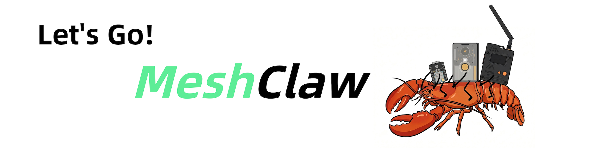
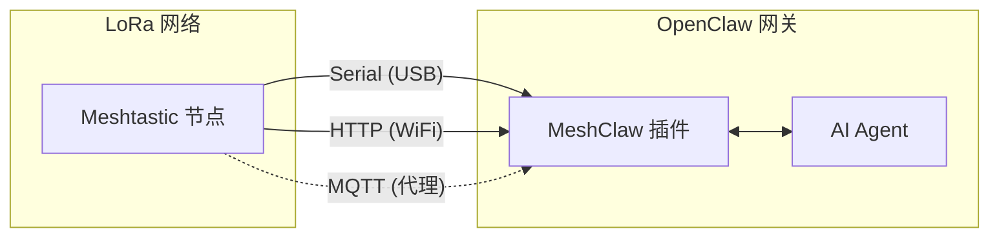

# MeshClaw: OpenClaw Meshtastic 频道插件

<p align="center">
  <a href="https://www.npmjs.com/package/@seeed-studio/meshtastic">
    
  </a>
  <a href="https://www.npmjs.com/package/@seeed-studio/meshtastic">
    
  </a>
</p>

<p align="center">
  <a href="README.md">English</a> | <a href="README.zh-CN.md"><b>中文</b></a> | <a href="README.ja.md">日本語</a>
</p>

<p align="center">
  
</p>

MeshClaw 是一个 OpenClaw 频道插件，通过 Serial (USB)、HTTP (WiFi) 或 MQTT 将你的 AI 网关连接到 Meshtastic LoRa 网络中。

> [!IMPORTANT]
> 此仓库是 **OpenClaw 频道插件**，不是独立应用。
> 使用前需要安装并运行 OpenClaw 网关（Node.js 22+）。

[Meshtastic 文档][docs] · [报告 bug][issues] · [请求功能][issues]

## 目录

- [前提条件](#prerequisites)
- [快速开始](#quick-start)
- [工作原理](#how-it-works)
- [关键特性](#key-features)
- [传输模式](#transport-modes)
- [访问控制](#access-control)
- [配置](#configuration)
- [演示](#demo)
- [推荐硬件](#recommended-hardware)
- [故障排除](#troubleshooting)
- [限制](#limitations)
- [开发](#development)
- [贡献](#contributing)
- [许可](#license)

## 前提条件

- 已安装并运行 OpenClaw 网关
- Node.js 22+
- 一种 Meshtastic 连接方式：
  - 通过 USB 的串行设备，或
  - 本地网络上的 HTTP 启用 Meshtastic 设备，或
  - MQTT 代理访问（无需本地硬件）

## 快速开始

```bash
# 1) 从 npm 安装插件
openclaw plugins install @seeed-studio/meshtastic

# 2) 运行引导设置
openclaw onboard

# 3) 验证频道状态
openclaw channels status --probe
```

<p align="center">
  
</p>

## 工作原理



入站消息在到达 AI 代理之前会通过 DM/群组策略检查。
出站回复会被转换为纯文本并分块进行无线电传输。

## 关键特性

- **三种传输方式**：串行、HTTP 和 MQTT
- **DM 策略控制**：`配对`、`开放`或`白名单`
- **群组策略控制**：`禁用`、`开放`或`白名单`
- **@mention 门控**：仅在群组中被提及时回复（可选）
- **多账户支持**：运行多个独立的 Meshtastic 连接
- **健壮的传输处理**：不稳定链接的重连行为

## 传输模式

| 模式 | 适用于 | 必需字段 |
|---|---|---|
| `serial` | 本地 USB 连接的节点 | `transport`、`serialPort` |
| `http` | 可在本地网络中访问的节点 | `transport`、`httpAddress` |
| `mqtt` | 无本地硬件，共享代理 | `transport`、`mqtt.*`、`nodeName` |

注意：
- `serial` 是默认传输方式。
- `mqtt` 默认：代理 `mqtt.meshtastic.org`，主题 `msh/US/2/json/#`。
- 区域设置适用于 Serial/HTTP；MQTT 从主题中获取区域。

## 访问控制

### DM 策略 (`dmPolicy`)

| 值 | 行为 |
|---|---|
| `pairing`（默认） | 新用户需要批准后才能进行 DM 聊天 |
| `open` | 任何节点都可以进行 DM |
| `allowlist` | 只有 `allowFrom` 中的 ID 可以进行 DM |

### 群组策略 (`groupPolicy`)

| 值 | 行为 |
|---|---|
| `disabled`（默认） | 忽略群组频道 |
| `open` | 在所有群组频道中回复 |
| `allowlist` | 仅在配置的频道中回复 |

您还可以为每个频道要求提及（`requireMention`），这样机器人只有在被明确标记时才会回复。

## 配置

使用 `openclaw onboard` 进行引导设置，或使用 `openclaw config edit` 手动编辑配置。

### 串行 (USB)

```yaml
channels:
  meshtastic:
    transport: serial
    serialPort: /dev/ttyUSB0
    nodeName: OpenClaw
```

### HTTP (WiFi)

```yaml
channels:
  meshtastic:
    transport: http
    httpAddress: meshtastic.local
    nodeName: OpenClaw
```

### MQTT (代理)

```yaml
channels:
  meshtastic:
    transport: mqtt
    nodeName: OpenClaw
    mqtt:
      broker: mqtt.meshtastic.org
      username: meshdev
      password: large4cats
      topic: "msh/US/2/json/#"
```

### 多账户

```yaml
channels:
  meshtastic:
    accounts:
      home:
        transport: serial
        serialPort: /dev/ttyUSB0
      remote:
        transport: mqtt
        mqtt:
          broker: mqtt.meshtastic.org
          topic: "msh/US/2/json/#"
```

<details>
<summary><b>配置参考</b></summary>

| 键 | 类型 | 默认值 | 备注 |
|---|---|---|---|
| `transport` | `serial \| http \| mqtt` | `serial` | 基础传输 |
| `serialPort` | `string` | - | `serial` 所需 |
| `httpAddress` | `string` | `meshtastic.local` | `http` 所需 |
| `httpTls` | `boolean` | `false` | HTTP TLS |
| `mqtt.broker` | `string` | `mqtt.meshtastic.org` | MQTT 代理主机 |
| `mqtt.port` | `number` | `1883` | MQTT 端口 |
| `mqtt.username` | `string` | `meshdev` | MQTT 用户名 |
| `mqtt.password` | `string` | `large4cats` | MQTT 密码 |
| `mqtt.topic` | `string` | `msh/US/2/json/#` | 订阅主题 |
| `mqtt.publishTopic` | `string` | derived | 可选覆盖 |
| `mqtt.tls` | `boolean` | `false` | MQTT TLS |
| `region` | enum | `UNSET` | Serial/HTTP 仅 |
| `nodeName` | `string` | auto-detect | MQTT 所需 |
| `dmPolicy` | `open \| pairing \| allowlist` | `pairing` | DM 访问策略 |
| `allowFrom` | `string[]` | - | DM 白名单，例如 `!aabbccdd` |
| `groupPolicy` | `open \| allowlist \| disabled` | `disabled` | 群组频道策略 |
| `channels` | `Record<string, object>` | - | 每频道覆盖 |
| `textChunkLimit` | `number` | `200` | 允许范围：`50-500` |

</details>

<details>
<summary><b>环境变量覆盖</b></summary>

这些变量覆盖默认账户字段：

| 变量 | 配置键 |
|---|---|
| `MESHTASTIC_TRANSPORT` | `transport` |
| `MESHTASTIC_SERIAL_PORT` | `serialPort` |
| `MESHTASTIC_HTTP_ADDRESS` | `httpAddress` |
| `MESHTASTIC_MQTT_BROKER` | `mqtt.broker` |
| `MESHTASTIC_MQTT_TOPIC` | `mqtt.topic` |

</details>

## 演示

<div align="center">

https://github.com/user-attachments/assets/837062d9-a5bb-4e0a-b7cf-298e4bdf2f7c

</div>

备用：[media/demo.mp4](media/demo.mp4)

## 推荐硬件

<p align="center">
  
</p>

| 设备 | 适用于 | 链接 |
|---|---|---|
| XIAO ESP32S3 + Wio-SX1262 套件 | 入门级开发 | [购买][hw-xiao] |
| Wio Tracker L1 Pro | 便携式现场网关 | [购买][hw-wio] |
| SenseCAP Card Tracker T1000-E | 紧凑型追踪器 | [购买][hw-sensecap] |

任何 Meshtastic 兼容的设备都适用。MQTT 模式可以在没有本地硬件的情况下运行。

## 故障排除

| 症状 | 检查 |
|---|---|
| 串行无法连接 | `serialPort` 是否正确？主机是否有设备权限？ |
| HTTP 无法连接 | `httpAddress` 是否可达？`httpTls` 是否设置正确？ |
| MQTT 收不到消息 | 主题区域是否正确？代理凭据是否有效？ |
| 没有 DM 回复 | 检查 `dmPolicy` 和 `allowFrom` |
| 没有群组回复 | 检查 `groupPolicy`、白名单和提及要求 |

提交 issue 时，请包括传输方式、配置（隐藏密钥）和 `openclaw channels status --probe` 输出。

## 限制

- LoRa 消息带宽受限；回复会被分块（`textChunkLimit`，默认 `200`）。
- 发送到无线电设备的文本会被移除富文本格式。
- 网络质量、范围和延迟取决于无线电环境和网络条件。

## 开发

```bash
git clone https://github.com/Seeed-Solution/openclaw-meshtastic.git
cd openclaw-meshtastic
npm install
openclaw plugins install -l ./openclaw-meshtastic
openclaw channels status --probe
```

无需构建步骤。OpenClaw 直接从 `index.ts` 加载 TypeScript 源代码。

## 贡献

- 通过 [GitHub Issues][issues] 提交 issue 和功能请求
- 欢迎提交 Pull Request
- 保持更改与现有的 TypeScript 习惯一致

## 许可

MIT

<!-- Reference-style links -->
[docs]: https://meshtastic.org/docs/
[issues]: https://github.com/Seeed-Solution/openclaw-meshtastic/issues
[hw-xiao]: https://www.seeedstudio.com/Wio-SX1262-with-XIAO-ESP32S3-p-5982.html
[hw-wio]: https://www.seeedstudio.com/Wio-Tracker-L1-Pro-p-6454.html
[hw-sensecap]: https://www.seeedstudio.com/SenseCAP-Card-Tracker-T1000-E-for-Meshtastic-p-5913.html